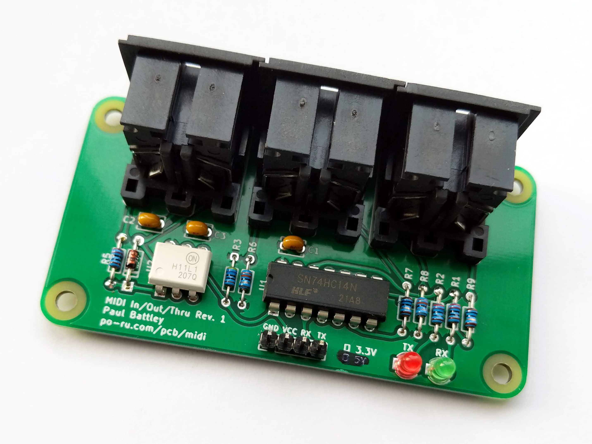

# MIDI In/Out/Thru

I wanted a MIDI interface for microcontrollers that would

- work on 3.3V,
- use full-size DIN connectors,
- include MIDI Thru, and
- have all the connectors in one line.

This achieves that. You can attach it to a Raspberry Pi to give MIDI in to
[MiniDexed](https://github.com/probonopd/MiniDexed) or to a Raspberry Pi Pico
to make a USB to MIDI interface with [MIDI adapter
code](https://github.com/rsta2/pico/tree/main/midi_adapter).

If you don't want activity LEDs, you can omit R1, R2, LED1, LED2.

It's also possible to adapt this to 5V by changing R1 and R2 to 330 ohms,
and R6, R7, R8 and R9 to 220 ohms.
